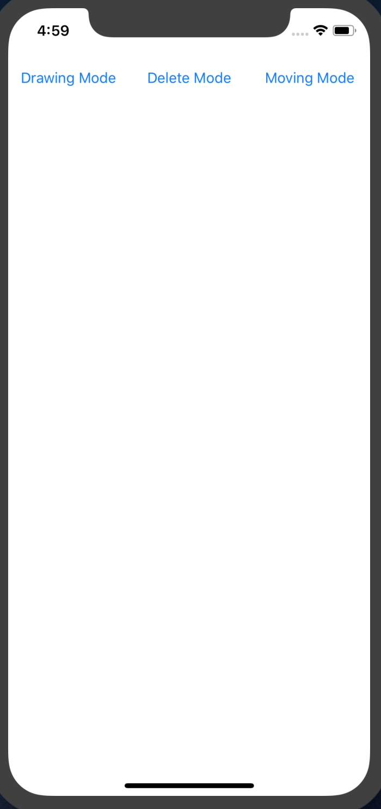
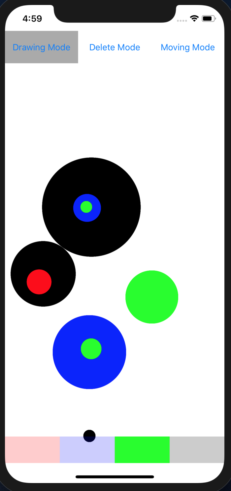
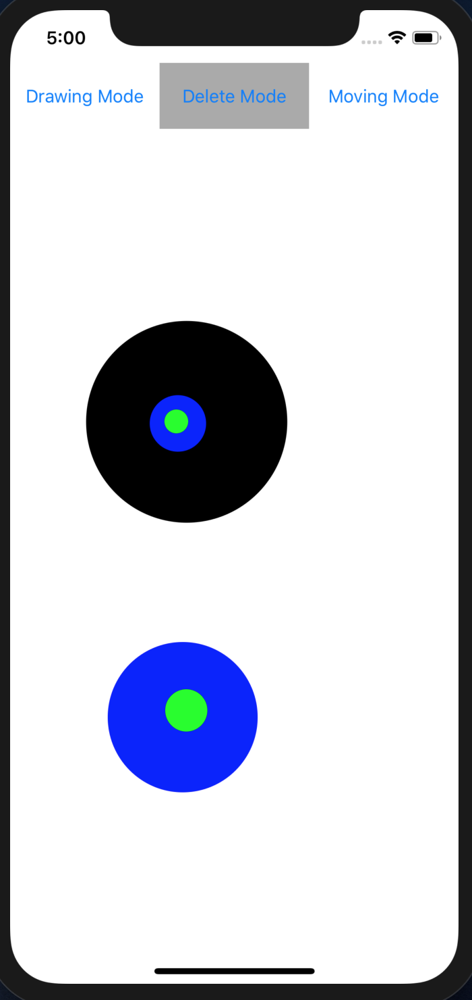
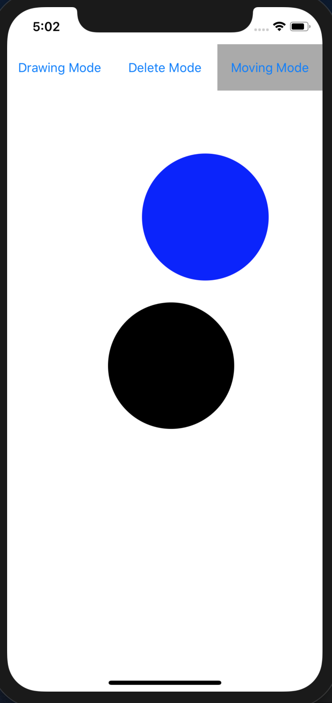

# Drawing-Animation-App

IOS app that draw circles of any size,any color from given 4 colors and move circle by swiping. Circle bounces back from edges. 

# Fetaures

•	Drawing mode has 4 colors( red,blue,black and green)
•	circle can grow by dragging in drawing mode. once touch ended, radius of circle gets fixed
•	Circle is removed in Delete mode. Multiple circle gets delete if overlapping.
• Circle moves by swiping at any direction with swping speed. 
•	Superior Design
•	Build with Swift

# Requirements

• IOS 12

# Screenshots

